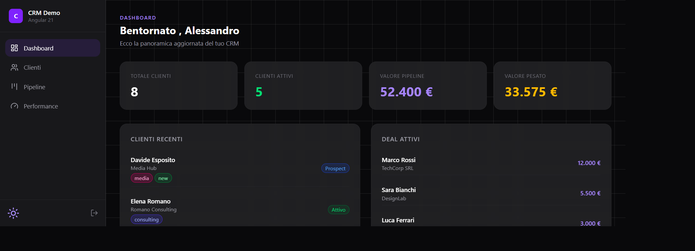
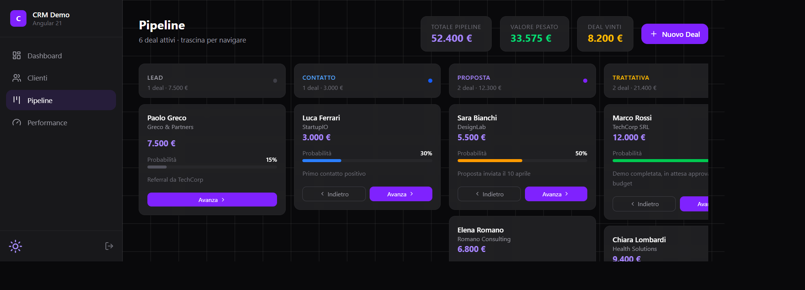
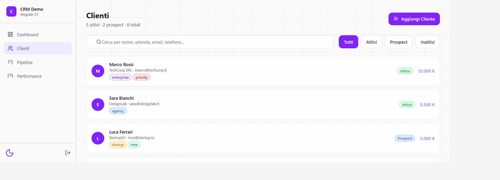
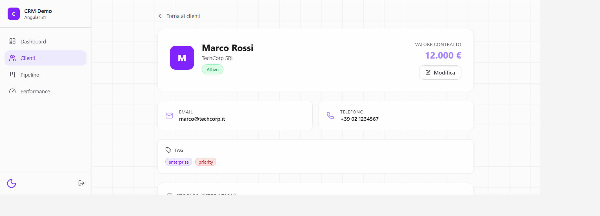

<div align="center">

# angulr-ia · CRM Demo

**A micro-CRM built to showcase Angular 21's most modern features**

[](https://angular.dev)
[](https://www.typescriptlang.org)
[](https://ngrx.io)
[](https://tailwindcss.com)
[](https://angular.dev/guide/zoneless)
[](https://microcrm-angular21.vercel.app)

[Live Demo](https://microcrm-angular21.vercel.app) · [Source Code](https://github.com/Allfrenk/angulr-ia)

</div>

---

## What is this?

`angulr-ia` is a **portfolio-grade CRM demo** built with Angular 21, designed to demonstrate real-world usage of the framework's most modern APIs — not just toy examples.

Every feature in this app serves a dual purpose: it functions as a working CRM (clients, pipeline, dashboard) and it documents itself, explaining to the reader exactly which Angular 21 patterns are being used and why.

> **No backend. No external APIs. All data lives in NgRx Signal Stores.**
> Refreshing the page resets the state — by design. This is a frontend architecture showcase, not a production app.

---

## Who is this for?

This project is aimed at **technical recruiters and senior engineers** evaluating Angular 21 proficiency. It covers:

- Architectural decisions (Zoneless, OnPush, Signal-first state)
- Modern reactive patterns without boilerplate
- Experimental APIs used correctly (Signal Forms, `resource()`)
- Code organization and component composition

Every page has an interactive "Patterns used" section with clickable pills that explain each Angular 21 concept — making the codebase self-documenting for technical interviews.

---

## Screenshots

<div align="center">

| Dashboard (dark) | Pipeline Kanban |
|:---:|:---:|
|  |  |

| Clients with search | Client Detail |
|:---:|:---:|
|  |  |

</div>

---

## Tech Stack

| Layer | Technology |
|-------|-----------|
| Framework | Angular 21.2 — Zoneless, Standalone |
| State | NgRx Signal Store (`signalStore`, `withComputed`, `patchState`) |
| Forms | Signal Forms (`form()`, `FormField`, `required()`) — experimental |
| Styling | Tailwind CSS v4 with `@tailwindcss/postcss` |
| Icons | Lucide Angular |
| Testing | Vitest |
| Linting | ESLint flat config |
| Deploy | Vercel |

---

## Angular 21 Features — Complete Coverage

### Signals Core
`signal()` · `computed()` · `effect()` · `linkedSignal()` · `resource()` · `input()` · `viewChild()` · `toSignal()`

### NgRx Signal Store
`signalStore()` · `withState()` · `withComputed()` · `withMethods()` · `patchState()`

### Signal Forms *(experimental)*
`form()` · `FormField` directive · `required()` · `email()` · field state signals (`touched()`, `invalid()`, `errors()`)

### Template Control Flow
`@if @else` · `@for @empty` · `@switch` · `@defer` (on timer, on viewport) · `@placeholder` · `@loading` · `@let`

### Architecture
Zoneless change detection · OnPush on shared components · Standalone components · Lazy routing · `CanActivateFn` guard · `Location.back()` · `takeUntilDestroyed()`

### RxJS Interop
`debounceTime` · `distinctUntilChanged` · `takeUntilDestroyed` · `FormControl.valueChanges` → Signal Store

---

## Pages

### 🏠 Landing
Animated spotlight effect tracking mouse position. SpotlightStore manages mouse coordinates with `withComputed()` deriving the gradient style. Dark/light theme toggle with `localStorage` persistence.

### 🔐 Login
Signal Forms demo with read-only pre-filled credentials (`demo@crm.io` / `demo1234`). Demonstrates `form()`, `FormField` directive, and signal-based loading state. Auth state persisted in `localStorage` via `AuthStore`.

### 📊 Dashboard
Four KPI cards derived from `ClientsStore` and `PipelineStore` computed signals. Recent clients and active deals with direct signal rendering. `resource()` card simulating an async API call with skeleton loading states (`isLoading()`, `error()`, `value()`). Pattern pills section with `@defer (on timer(500ms))`.

### 👥 Clients
Full-featured client list with:
- **RxJS search pipeline**: `FormControl` → `debounceTime(300)` → `distinctUntilChanged()` → `takeUntilDestroyed()` → `ClientsStore.setSearch()`
- **Signal pagination**: `linkedSignal()` resets `currentPage` to 1 automatically on filter/search change
- **Status filters**: reading initial filter from route `queryParams` (set by dashboard KPI links)
- **Add client modal**: Signal Forms with validation

### 👤 Client Detail
Route param extracted with `toSignal(route.paramMap)`. Client derived as a `computed()` signal — reactive to route changes without `ngOnInit`. Editable fields with Signal Forms. Editable tags with predefined color map (`tags.ts`). Interaction history with `@defer (on viewport)`.

### 🎯 Pipeline
Six-stage Kanban board with:
- `dealsByStage` — `computed()` returning `Map<DealStage, Deal[]>`
- `moveToStage()` — immutable `patchState()` update
- Horizontal drag-to-scroll with `viewChild<ElementRef>()`
- `@let` for cached computed values inside `@for`
- Deal name links to client detail via `ClientsStore` lookup
- Add deal modal with Signal Forms

### ⚡ Performance
Build bundle analysis with real production sizes. Zoneless performance metrics vs zone.js (Angular team benchmarks). Full Angular 21 feature coverage checklist.

---

## Architecture Decisions

### Why Zoneless?
`zone.js` monkey-patches browser async APIs and triggers change detection on every async callback — even unrelated ones. Removing it saves ~33KB bundle and eliminates unnecessary CD cycles. In this app, all state updates flow through signal stores, so `provideZonelessChangeDetection()` is a natural fit.

### Why Signal Store over Redux?
NgRx Signal Store is leaner than the classic Action/Reducer/Effect pattern for this scale of app. `withComputed()` replaces selectors, `withMethods()` replaces effects for sync operations. The store is tree-shakable and doesn't require module registration.

### Why Signal Forms over Reactive Forms?
Signal Forms (experimental in Angular 21) eliminate `FormGroup` boilerplate, `valueChanges` subscriptions, and the `takeUntil(destroy$)` pattern. The `form()` function creates a reactive `FieldTree` from a signal model — validation is declarative and errors are accessible as signal arrays.

### Why Tailwind v4?
Tailwind v4 drops `tailwind.config.js`, uses a single `@import "tailwindcss"` in a `.css` file (not `.scss` — incompatible), and scans templates automatically. Zero configuration, faster builds.

---

## Running Locally

```bash
# Clone
git clone https://github.com/Allfrenk/angulr-ia.git
cd angulr-ia

# Install
npm install

# Serve (dev)
npm start

# Build (production)
npm run build

# Test
npm test

# Lint
npm run lint
```

**Demo credentials:** `demo@crm.io` / `demo1234`

---

## Project Structure

```
src/app/
├── core/
│   ├── data/          # tech-glossary.ts, tags.ts
│   ├── guards/        # auth-guard.ts
│   ├── services/      # theme.ts
│   └── store/         # auth, clients, nav, pipeline, spotlight stores
├── features/
│   ├── auth/          # login
│   ├── clients/       # clients list + client detail
│   ├── dashboard/
│   ├── landing/
│   ├── performance/
│   └── pipeline/
├── layout/            # layout with sidebar + router-outlet
└── shared/
    └── components/    # grid-background, feature-pill, sidebar, theme-toggle
```

---

## Performance

| Metric | Value |
|--------|-------|
| zone.js removed | ✅ ~33KB saved |
| Rendering improvement | +30–40% vs zone.js |
| Memory reduction | 15–20% |
| Change detection | Signal-driven only |
| Lazy loaded | Landing + Login (not in main bundle) |

*Source: Angular team benchmarks, PkgPulse 2025, angular.dev/guide/zoneless*

---

## Author

**Alessandro Catania** · Frontend Developer · Angular specialist

[](https://github.com/Allfrenk)
[](https://linkedin.com/in/alessandrocatania)

---

<div align="center">
<sub>Built with Angular 21 · No zone.js · No NgModules · No boilerplate</sub>
</div>
